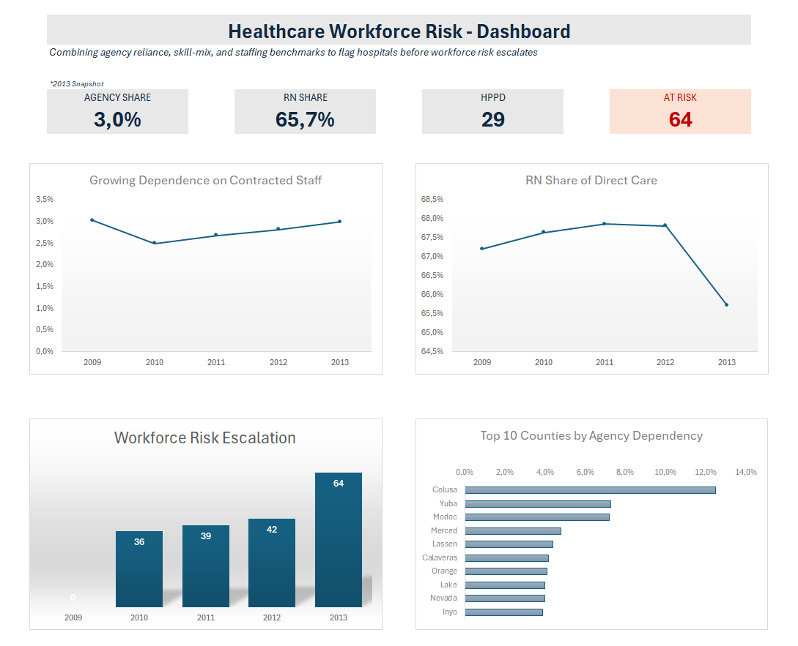

# 🏥 Hospital Workforce Risk Analysis

**Excel · Pivot Tables · 464 hospitals · 2009–2013**

Can you tell a hospital is heading into a staffing problem before it actually becomes one, just from the numbers? I picked a public hospital staffing dataset to find out, after seeing a workforce planning role open up and wanting to show I could do the job, not just talk about it. Small rural hospitals quietly losing their nurses to agency workers is the pattern that answered the question.

-----

## 📊 What the dashboard shows



Agency reliance dipped after 2010, then climbed back up, ending 2013 almost exactly where it started.

Registered nurse share tells a different story. It sat near 68% for three years, then fell to 65.7% in 2013. The sharpest single-year drop in the whole dataset, and it landed the same year agency reliance was climbing again.

Put those two together and the number of hospitals flagged at risk jumped 78% in three years, from 36 in 2010 to 64 in 2013. 147 different hospitals were affected at some point, not the same handful over and over.

And it isn't spread evenly. Colusa, Yuba, Modoc, Merced, Lassen: every county at the top of the agency-reliance list is small and rural.

-----

## 🗂️ The data behind it

One CSV from Kaggle, California hospital staffing reports, 2009 to 2013.

37,604 rows, but not 37,604 hospitals. Each hospital gets 17 rows per year, one per staff category, so one hospital over 5 years is easily 85 rows. Grouped by hospital and year, that becomes 2,207 hospital-year records covering 464 hospitals.

85 of the original rows (5 full hospital-years) had no hospital name or ID at all. Left out. No way to know whose numbers they were.

-----

## 🧮 The bug I almost missed

The 17 staff categories per hospital-year aren't 17 separate things. 10 describe who did the work (nurse, aide, agency worker). 7 describe which department the hours were billed to. Same hours, sliced two different ways. Add all 17 together and you double almost every number, with no error message telling you it happened.

I caught it by checking whether both groupings added up to the same total per hospital. Most of the time they did, which is exactly why it's easy to miss. About 500 of the 2,207 hospital-years didn't match, one case off by over a million hours in a single year, most likely incomplete reporting on one side. Every number in this project now comes from the staff-type grouping only.

From there, each hospital-year tracks agency reliance, registered nurse share, staffing level against similar hospitals, how each changed from the year before, and whether all three warning signs hit at once. That last one is the risk flag, and it's deliberately strict: agency use up, nurse share down, *and* staffing below peers, all in the same year. Any one alone is common. All three together is rare, and worth a conversation.

The biggest single jump among hospitals that hit all three signals belongs to a small rural hospital that went from barely using agency staff to about 15.7% of its hours being agency, in one year. Roughly 1 in every 6 hours. My read is that this is a hiring and retention problem more than a budget one, since it's concentrated in rural counties rather than spread evenly, but that's an interpretation, not something the data proves outright.

-----

## 💡 Other things worth knowing

"Agency reliance" is a bit broader than it sounds. It includes agency nurses, but the raw data also lumps in some non-nursing contract staff, kitchen or cleaning workers, under the same category.

Hospitals are only compared to similar hospitals, not to a flat average. A small specialty hospital doesn't staff the same way as a large general one, so each one is measured against others of the same ownership type, in the same year.

Staff titles don't translate the same everywhere, either. What this dataset calls "Aides & Orderlies" is a Healthcare Assistant in Ireland and the UK.

And the "LVN" title has no clean match outside the US at all, since most other countries only license two nursing tiers, nothing in between. Worth keeping in mind if this ever gets compared against staffing data from somewhere else.

One more thing on the nurse share numbers specifically: this is acute hospital data, where staffing ratio laws mean nurses handle most direct care themselves. Nursing homes and disability care run differently, nurses mostly supervise there. The method still applies, watching the trend, flagging when it worsens. The expected ratio just wouldn't be the same.

-----

## 🛠️ Tools and measures

| | |
|---|---|
| Kaggle | Source data |
| Excel · Pivot Tables | Grouping raw rows into hospital-year records |
| Excel formulas | Shares, year-over-year change, peer comparison, risk flag |
| GitHub | Version control and portfolio |

```
Agency Share = Agency Hours ÷ Total Hours Worked

RN Share = RN Hours ÷ (RN Hours + LVN Hours + Aide Hours)

Peer Benchmark = AVERAGEIFS(Total HPPD, Ownership Type, Year)

Agency Share Change = This Year's Agency Share − Last Year's Agency Share

RN Share Change = This Year's RN Share − Last Year's RN Share

Risk Flag = IF(
    Agency Share Change > 0
    AND RN Share Change < 0
    AND Total HPPD < Peer Benchmark,
  "At Risk", "")
```


